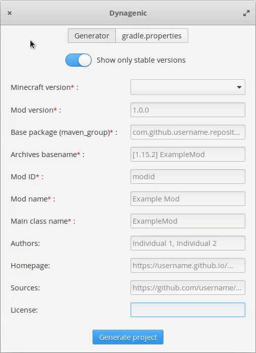

<p align="center">
    
</p>

# Dynagenic 
A FabricMC project template generator  
 <br> 
 
 ##### Notes: Dynagenic was designed to look like in the image below on elementaryOS. It looks different in other operating systems.

<p align="center">
    
</p>
<br><br>

# Getting Dynagenic

Dynagenic can be obtained for Linux as an AppImage on the releases page: https://github.com/Levoment/Dynagenic/releases

Alternatively, you can build it from source. See below for more information.

# Building

## Dependencies
Dynagenic depends on the following libraries which must be present before building the project:

  * `gtk+-3.0`
  * `gee-0.8`
  * `libsoup-2.4`
  * `json-glib-1.0`
  * `libarchive`

To compile, you will need also to have installed
  
  * `valac`
  * `meson`
  * `ninja` 

On an **Ubuntu** based system, you can install all of those dependencies and requirements with:

`sudo apt install valac meson ninja-build libgtk-3-dev libgee-0.8-dev libsoup2.4-dev libjson-glib-dev libarchive-dev`

## Build
Once all the dependencies and commands have been installed, navigate in a terminal to the directory containing the sources and issue the following commands:
```
meson build --prefix=/usr && cd build
ninja
```
## Running Dynagenic
If you completed the previous step succesfully, you can run Dynagenic without installing it into the system by issuing the following command on the same directory the built binary is located (**build** in this case):

`./com.github.levoment.dynagenic`

If any problems occur when Dynagenic is run, run it with the following command which will output to the terminal debugging information:

`G_MESSAGES_DEBUG=all ./com.github.levoment.dynagenic`

## Installing Dynagenic
If you wish to install **Dynagenic** to the system, while in the same directory in which the command **ninja** was run above, execute the following command:

`sudo ninja install`
